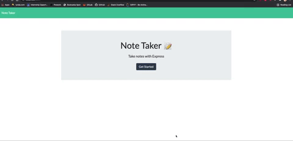

# note-taker
Notes Taker is a full stack application which allows the user to create and save a new note. Once the note is saved it appears on the left panel. User also has an option to delete a note. 

## Getting Started
1. Install express
2. Install uuid

## Usage 
1. generate database with "node server.js"
 2. (note: if link hasn't been visited in a while it may take a minute for Heroku to launch the website)

## Mock Up

## Built With

* [JavaScript]
* [Nodejs]
* [HTML] 
* [CSS]
* [Express]
* [uuid]

## Deployed Link

* [See Live Site](#) https://github.com/umeramalek/note-taker
* [See Live Site](#) https://limitless-wildwood-50539.herokuapp.com/

## Authors

* **UMERA MALEK** 

- [Link to Portfolio Site](https://umeramalek.github.io/)
- [Link to Github](https://github.com/umeramalek)
- [Link to LinkedIn](www.linkedin.com/in/umeramalek)
